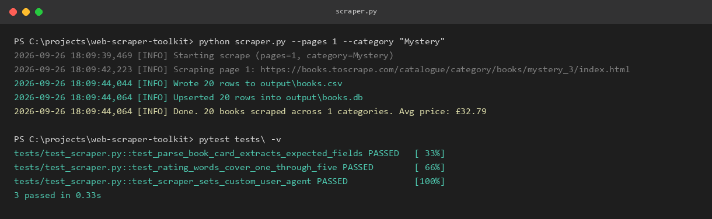
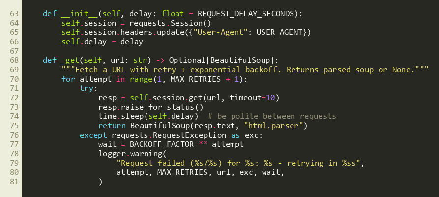

# Web Scraper Toolkit

A small, production-minded web scraper built to demonstrate how I approach
data-collection automation for clients: polite request handling, retries,
structured storage, tests, and a scheduling hook for unattended runs.

**Target:** [books.toscrape.com](https://books.toscrape.com) - a public
sandbox site built specifically for scraping practice, so the project is
safe to run, demo, and share without hitting anyone's production site or
ToS.

## In action





## Why this design

Freelance scraping requests usually come with the same underlying asks:
*"pull this data on a schedule, don't get blocked, and give me a database
I can query, not just a one-off CSV."* This project is structured around
that:

- **Retries with exponential backoff** - flaky connections/pages don't kill
  the whole run.
- **Rate limiting** - a fixed delay between requests so the target site
  isn't hammered.
- **Dual output** - SQLite (for querying/joining later) *and* CSV (for
  quick handoff to a client or Excel).
- **Idempotent upserts** - re-running the scraper updates existing rows
  (by URL) instead of duplicating them, which matters for scheduled runs.
- **CLI flags** - scope a run to N pages or a single category without
  touching code, useful for testing before a full run.
- **Cron-ready** - `schedule_scrape.sh` shows how this would run
  unattended on a server.

## Usage

```bash
pip install -r requirements.txt

# Full scrape (all categories), saved to ./output/books.csv and books.db
python scraper.py

# Scope it down for a quick test
python scraper.py --pages 2 --category "Travel"

# Custom output location and slower request pace
python scraper.py --output-dir out/2026-09-26 --delay 2.0
```

## Project layout

```
web-scraper-toolkit/
├── scraper.py            # scraper class, CLI entry point
├── schedule_scrape.sh    # example cron wrapper for daily runs
├── tests/
│   └── test_scraper.py   # parser unit tests (no network calls)
├── requirements.txt
├── images/                # screenshots used in this README
└── output/                # generated CSV/SQLite files land here (gitignored)
```

## Running tests

```bash
pytest tests/
```

## Adapting this for a real project

Swapping the target site means updating the CSS selectors in
`_parse_book_card` and `get_categories` - everything else (retry logic,
storage, CLI, scheduling) is site-agnostic and reusable as-is. This is
the same shell I'd use for a client engagement: e-commerce price
monitoring, competitor listing trackers, lead-list building from
directories, etc.
